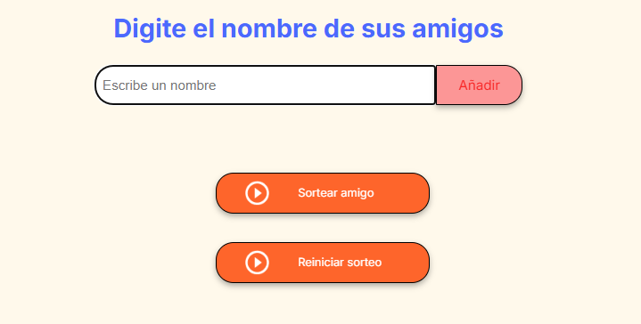

<h1 align="center">Amigo secreto challenge Alura </h1>

    

## 📋 Descripción del proyecto
Una pagina web en la que se implementa lógica de programación para desarrollar un pequeño juego donde se añaden nombres de sus amigos, se almacenan en una lista, se sortea un nombre aleatorio de la lista y se muestra en pantalla en nombre resultante.

## 🔨 Funcionalidades del proyecto
- `Agregar nombres:` El usuario escribira el nombre de un amigo en el input de texto y lo agregara a la lista con el boton añadir.

- `Validar entreda:` Si el input está vacío aparecera un mensaje en pantalla pidiendo un nombre valido.

- `Visualizar la lista:` Aparecera una lista de los nombres ingresados en el input.

- `Sorteo aleatorio:` Al hacer clic en el botón "Sortear Amigo", se seleccionará aleatoriamente un nombre de la lista y se mostrará en la página.

## 🔌 Caracteristicas de aplicación y demostración

    

La pagina consta de un cuadro de texto donde se deben ingresar al menos 2 nombres de amigos uno por uno dando al boton "Añadir" y apareceran en la pantalla en forma de lista; por debajo está el boton "Sortear amigo" al dar click en el se hara el sorteo y al nombre resultante aparecera en la pantalla.
Por ultimo el boton "Reiniciar sorteo" cmo el nombre lo indica se reiniciara la lista y se podra volver a intentar un nuevo sorteo si necesidad de recargar la pagina.

## 🔑 Acceso al proyecto

 👉 [`Amigo secreto challenge`](https://bernal30.github.io/amigo-secreto-challenge/)

## ✔ Tecnologias utilizadas

- JavaScript
- HTML
- CSS

## 📖 Conclusión
Crear este pryecto a fomentado sin duda el desarrollo de la lógica de programación, el estar sentado resolviendo pequeños errores a lo largo de la creación del código funcional, buscar en internet documentación sobre la sintaxis, posibles aplicaciones de como abordar una solución y ambién el hecho de pensar en `conceptos` antes que empezar a escribir código formular las funciones necesarias para un usuario han enriquecido la experiencia de comenzar un proyecto por voluntad propia.

## 🧙‍♂️ Autores

- [Bernal](https://github.com/Bernal30)